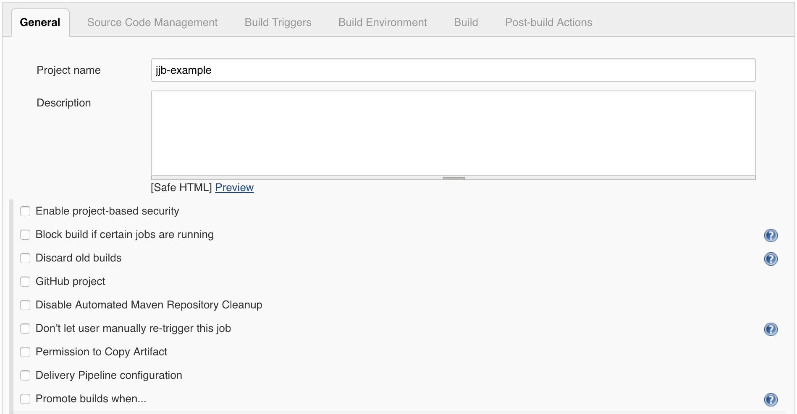

# Jenkins Job Builder

Human readable jenkins job definition

---

## Jenkins job configuration

* create jobs on the UI
* stored as XML files

@fa[arrow-down]
+++


<span style="color:gray; font-size: 0.5em;">Jenkins UI</span>

---

## Infrastructure as a code
(Store it in VCS)

* complicated syntax
* hard to follow changes

@fa[arrow-down]
+++?code=src/jjb-example.xml&lang=xml

<span style="color:gray; font-size: 0.5em;">Simple job in native format</span>

---

## Jenkins job builder

* simple
* human readable YAML
* auditable

@fa[arrow-down]
+++?code=src/jjb-example.yml&lang=yaml

<span style="color:gray; font-size: 0.5em;">Same with jenkins-job-builder</span>

---

## Installation

`pip install jenkins-job-builder`

---

## Job definitions
1. job
2. job template
3. project
4. job group
5. macro
6. defaults

---

**Job**: Describe a single job

```yaml
- job:
    name: job1
    project-type: freestyle
    description: 'Do not edit this job through the web!'
    concurrent: true
    quiet-period: 5
    node: NodeLabel1 || NodeLabel2
    builders:
      - shell: "make install"

- job:
    name: job2
    project-type: maven
    goals: deploy
```
@[1-9](Freestyle job)
@[11-14](Maven job)

---

**Job template**: Create several nearly identical jobs

```yaml
- project:
    name: test-project
    jobs:
      - '{name}-job'
  
- job-template:
    name: '{name}-job'
    builders:
      - shell: 'echo "Job name: {name}-job"'
```
@[4,7,9](Variable interpolation)
@[7](Template name must contain variables)

---

**Project**: Collect related jobs together

```yaml
- project:
    name: project1
    options: '--show-source'
    jobs:
      - 'check-{name}-pep8'
      - 'check-{name}-pylint'
  
- project:
    name: project2
    jobs:
      - 'check-{name}-pep8'
          options: '--show-source --show-pep8'
      - 'check-{name}-pylint'
  
- job-template:
    name: 'check-{name}-pep8'
    options: '--first'
    scm: 
      - git:
          url: 'https://github.com/leki75/{name}.git'
    builders:
      - shell: &#8739;
          pip install pycodestyle
          pycodestyle {options} *.py
```
@[3,12,24](Provide values for template variables)
@[17,24](Default values for template variables)

---

**Project**: List variables

```yaml
- project:
    name: project-name
    pyver:
      - 26
      - 27
    jobs:
      - '{name}-{pyver}'

- job-template:
    name: '{name}-{pyver}'
    ...
```
@[3-5](Set to each value in the list)

---

**Job group**: Realize several templates together

```yaml
- job-template:
    name: '{name}-unit-tests'
    builders:
      - shell: unittest
    publishers:
      - email:
          recipients: '{mail-to}'

- job-template:
    name: '{name}-perf-tests'
    builders:
      - shell: perftest
    publishers:
      - email:
          recipients: '{mail-to}'

- job-group:
    name: '{name}-tests'
    jobs:
      - '{name}-unit-tests':
          mail-to: developer@nowhere.net
      - '{name}-perf-tests':
          mail-to: projmanager@nowhere.net

- project:
    name: project-name
    jobs:
      - '{name}-tests'
```
@[16-23,28](Group job templates)

---

**Macro**: Centralized definition of common tasks

```yaml
- builder:
    name: make-test
    builders:
      - shell: 'make test'

- job:
    name: foo-test
    builders:
      - make-test

- job:
    name: bar-test
    builders:
      - make-test
```
@[1-4,9,14](Builders can be defined as a macro)

---

**Macro**: Parameterized macros

```yaml
- wrapper:
    name: build-timeout
    wrappers:
      - timeout:
          timeout: '{timeout}'
          timeout-var: 'BUILD_TIMEOUT'
          fail: true
          type: absolute

- job:
    name: job-name
    wrappers:
      - build-timeout:
          timeout: 30
```
@[5,13-14](Macros can take parameters)

---

**Defaults**: Collect job attributes

```yaml
- defaults:
    name: global
    description: 'Do not edit this job'
    arch: i386

- job:
    name: job-name
    builders: 'echo {arch}'
```
@[2,6-9]('global' is used if not specified explicitly)

---

**Defaults**: Job level attributes override defaults
```yaml
- defaults:
    name: new-defaults
    type: freestyle
    properties:
      - build-discarder:
          days-to-keep: 30
        
- job:
    name:
    defaults: new-defaults
    properties:
      - throttle:
          option: project
          max-per-node: 2
```
@[4-6,11-14](Attributes superseeded by job definition)

---

## CLI usage
1. config file
2. test job definitions
3. update jenkins jobs
4. delete a job

---

#### Config file

```ini
[job_builder]
ignore_cache = False
keep_descriptions = False
#include_path =
recursive = True
# exclude =
allow_duplicates = False
allow_empty_variables = False

[jenkins]
user = <jenkins_user>
password = <jenkins_api_token>
url = <jenkins_url>
timeout = 30

[hipchat]
send-as = <hipchat_user>
authtoken = <hipchat_api_token>
```
@[1-8](Job builder configuration)
@[10-14](Jenkins specific settings)
@[16-18](HipChat settings)

---

#### Test job definitions
`jenkins-jobs test <jjb_definition>`

---

#### Update jenkins jobs
`jenkins-jobs --conf <config_file> update <jjb_definition>`

---

#### Delete a jenkins job
`jenkins-jobs --conf <config_file> delete <job_name>`

---

## Questions
[JJB documentation](https://docs.openstack.org/infra/jenkins-job-builder/)
